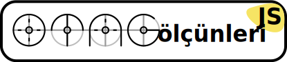

# eslint-config-otag


Otağ JavaScript Yiv Ölçünleri (Otağ JS Code Standards) yivlerinizi belirli ölçünlere getirir. Göz yormayan, okunaklı bir biçime bürür.

Bu yığınak, bir yiv düzeltmeni olan ESLint için paylaşılabilir ayar belgesi içerir.

## Kurulum

Tasalanmayın, tasarınızın olduğu dizine gelip komut dizesine şunu yazın:

```bash
npm i eslint-config-otag --save-dev
```

## Kullanım

.eslintrc dosyanıza `extends` açarına `["eslint-config-otag"]` değerini girin.

Üç farklı biçimde ekleyebilirsiniz.

.eslintrc.yml
```yaml
  extends: ['eslint-config-otag']
```

.eslintrc.json
```json
{
  "extends": ["eslint-config-otag"]
}
```

package.json
```json
{
  "name": "Tasarı Dürü'sü",
  "version": "0.0.1",
  "eslintConfig": {
    "extends": ["eslint-config-otag"]
  }
}
```

- - - -

## Damga



İsterseniz, kullandığınız tasarılarda bu damgayı koyabilirsiniz.

## Yeterge

MIT Özgür Yazılım Yetergesi [Otağ JS](http://otagjs.org)
